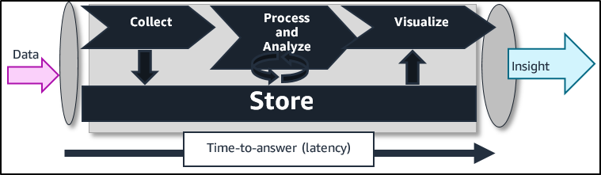
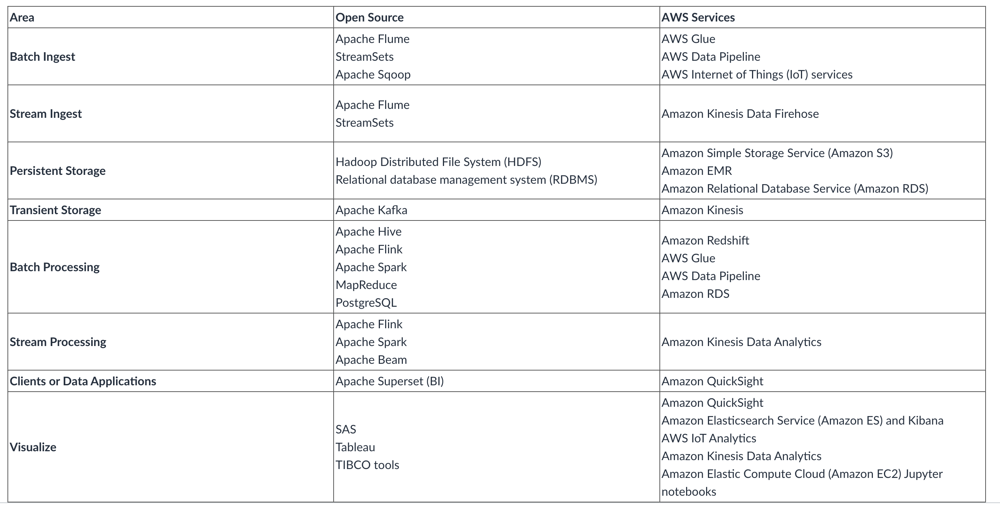

# Big Data

As society becomes increasingly digital, the amount of data being created and collected is growing and accelerating significantly. Analyzing this ever-growing data with traditional tools is a challenge. Innovation is required to bridge the gap between the data being generated and the data that can be analyzed effectively.

The concept of big data is more than just the collection and analysis of the data. The actual value of an organization’s data is found when questions can be answered and used to create competitive advantages for the organization.

## The AWS advantage in big data analytics

Analyzing large datasets requires significant compute capacity that can vary in size based on the amount of input data, the type of analysis, and the time required to complete the analysis. This characteristic of big data workloads is ideally suited to the pay-as-you-go cloud computing model, where resources can easily scale up and down based on demand. As requirements change, you can easily resize your environment (horizontally or vertically) on Amazon Web Services (AWS) to meet your needs, without having to wait for additional hardware or being required to overinvest to provision enough capacity. Also, because the services are managed by AWS, they are highly available without incurring additional costs of operations.

# Big Data Pipeline

The figure above illustrates the big data pipeline. The pipeline consists of the following phases:

- Data is collected (or ingested) by an appropriate tool.
- The data is persisted to storage.
- The data is processed or analyzed. The data processing or analysis solution takes the data from storage, performs operations, and then stores the data again.
- Analysis can be repeated to get further answers from the data.
- Data can be visualized with business intelligence (BI) tools to provide useful answers to business users.
- Insights are the output of the big data pipeline. The business owners use these insights to make critical decisions.

**Note**: Some big data solutions do not require visualizations. For example, machine learning and predictive analytics create models, which are used to answer questions or provide estimates based on the data that is analyzed.

The tools you deploy in your pipeline determine your time-to-answer, which is the latency between the time when your data is created and when you can get insight from it.

The best way to architect a big data solution that accounts for latency is to determine how to balance throughput with cost. A higher throughput (and the subsequent reduced latency) usually results in higher costs.

# Big Data Tools

There are many open source and proprietary big data tools that are available and that are currently used in the industry. AWS has managed-service versions of many open-standard tools. All these services can be seamlessly integrated with other services of AWS to provide users with a complete end-to-end solution for various big data analytics problems.

The following table provides a mapping of popular tools to AWS services.

# Big Data Collection

There are many ways in which the data can be collected for analysis. The following list provides more information about AWS collection services covered in this course.

- Amazon Elastic Compute Cloud (Amazon EC2)Links to an external site.: Amazon EC2 is a compute service that is good for hosting web applications. Agents can be installed on Amazon EC2 to send clickstream data, web server access logs, error logs, etc.
- Amazon KinesisLinks to an external site. (Amazon Kinesis Data Streams, Amazon Kinesis Video Streams, Amazon Kinesis Data Firehose, and Amazon Kinesis Data Analytics): Amazon Kinesis is a set of AWS services for processing big data in real time. Kinesis can process hundreds of terabytes per hour from high volumes of streaming data that comes from sources such as operating logs, financial transactions, and social media feeds
- Internet of Things (IoT)Links to an external site.: AWS offers a suite of IoT services that provide device software, control, and data services. These services enable you to connect securely to IoT devices and transfer the data at any scale. They also further provide the ability to store the data in various storage options and perform analytics.

# Big Data Storage

There are many storage options available in AWS, and all AWS storage options are made for specific purposes. The following list describes some of the more commonly used storage services for big data solutions. This course uses Amazon Simple Storage Service (Amazon S3) extensively.

- Amazon Simple Storage Service (Amazon S3)Links to an external site.: Amazon S3 is an object storage service that offers scalability, data availability, security, and performance. This means that customers of all sizes and industries can use it to store and protect any amount of data for a range of use cases, such as websites, mobile applications, backing up and restoring, archiving, enterprise applications, IoT devices, and big data analytics. Amazon S3 provides easy-to-use management features so you can organize your data and configure finely tuned access controls that are designed to help you meet your specific business, organizational, and compliance requirements. Amazon S3 is a good choice for staging data from various sources. It is also good for creating data lakesLinks to an external site..
- Amazon Relational Database Service (Amazon RDS)Links to an external site.: Amazon RDS enables you to set up and operate a relational database management system (RDBMS) in the AWS Cloud with minimal effort. It automates the backup and recovery process. It also provides scalable storage and multiple read replicas for better performance. Amazon RDS is suitable for structured data storage in AWS without any management overhead.
  Amazon DynamoDBLinks to an external site.:
- Amazon DynamoDB is a key-value and document database that delivers single-digit millisecond performance at any scale. It's a fully managed, multi-Region, multi-master database with built-in security, backup and restore capabilities, and in-memory caching for internet-scale applications.

# Big Data Ingestion

This stage of the data processing pipeline has some overlap with the Collection stage. Data can be collected by or ingested into AWS services in various ways. The following two managed AWS services—which can be used for ingestion—are included in this course.

- AWS GlueLinks to an external site.: AWS Glue is a fully managed extract, transform, and load (ETL) service that makes it easy for customers to prepare and load their data for analytics. ETL jobs can be created with a few clicks in the AWS Management Console. AWS Glue can discover data and store the inferred schema in the AWS Glue Data Catalog, which can then be available for ETL. AWS Glue can also act as a remote metadata store for various AWS services like Amazon Athena, AWS Data Pipeline, etc.
- AWS Data PipelineLinks to an external site.: Data Pipeline is a managed service that can be used to move data between various data sources in the AWS Cloud, like Amazon S3, Amazon RDS, DynamoDB, Amazon Redshift, and Amazon EMR. It can reduce the complexities of handling data pipelines, and reliably move data from source to destination in a cost-effective way.

# Big Data Processing and Analysis

In this stage of the data pipeline, data is processed and readied for analysis, visualization, and other downstream systems. Various managed and scalable services that are available in this space make it easy to implement. Three of the important services are described below. Amazon Elasticsearch Service and Amazon Redshift are both included in this course.

- Amazon EMRLinks to an external site. (Hadoop in AWS): Amazon EMR provides quick processing of large datasets using open source tools like Apache Spark, Apache Hive, Apache HBase, and Presto. Amazon EMR uses the scalable compute capacity of Amazon EC2 and the storage of Amazon S3. Processed data can be pushed to Amazon Redshift, DynamoDB, and Amazon RDS for further storage; or to Jupyter notebooks for analysis.
- Amazon RedshiftLinks to an external site. (data warehouse): Amazon Redshift is a petabyte-scale managed data warehouse service. Amazon Redshift makes it simple and cost-effective to analyze your data by using standard SQL and other BI tools. Amazon Redshift offers analytics features like columnar data storage, data compression, and massive parallel processing.
- Amazon Elasticsearch Service (Amazon ES)Links to an external site.: Amazon ES is an enterprise-grade search service that offers access to open-source Elasticsearch application programming interfaces (APIs). Amazon ES is a managed service that only needs to be configured, and is ready for use. It can be configured to be highly scalable and available to avoid downtimes. You can use Amazon ES with Logstash and Kibana to provide complete end-to-end solutions for log analysis and visualizations in real time.

# Big Data Visualization

Visualization is a critical component of any big data analytics solution. Visualization provides business decision makers with graphical representations of analysis, which can make it easier to see the implications of the data. Many visualization tools also create interactive graphics to allow for what-if scenario analysis. Some of the more important visualization tools provided by AWS are described below. Amazon SageMaker, Amazon QuickSight, AWS IoT Analytics, and Amazon Kinesis Data Analytics are all included in this course.

- Amazon SageMakerLinks to an external site.: Amazon SageMaker is a fully managed service for data scientists and developers. It covers the machine learning workflow to label and prepare your data, choose an algorithm, train a model, and tune and optimize the model for deployment. Amazon SageMaker models can also make predictions and take action.
- Jupyter notebooksLinks to an external site.: You can host Jupyter notebooks with Amazon SageMaker. Jupyter notebooks are an open-source tool you can use to create narratives that combine text with visualizations. There are many Jupyter notebooks available for fraud detection, forecasting, image classification, etc. In this course, learners learn to use Jupyter notebooks to create narratives that describe their analysis.
- AWS IoT AnalyticsLinks to an external site.: You can use the AWS IoT Analytics service to run real-time analytics directly on data sent by IoT devices. You can also run queries to send filtered data to a permanent data store or to visualization tools. It is a fully managed and highly scalable service that can be natively integrated with other services such as Amazon SageMaker Jupyter notebooks, DynamoDB, or external tools like Salesforce.
- Amazon Kinesis Data AnalyticsLinks to an external site.: You can use Amazon Kinesis Data Analytics to perform real-time analytics on data in Amazon Kinesis streams. It is a fully managed, highly available, and scalable service that can handle petabytes of data in a cost-effective, pay-as-you-go model. Structured query language (SQL) users can run queries on it, and developers can use Java libraries for sophisticated transformations and analysis.
- Amazon QuickSightLinks to an external site.: Amazon QuickSight is a data analysis and visualization service that you can use for a wide variety of data types and sources. You can use it to automatically discover data sources in your AWS solution, or you can pull data from other data sources in your organization. You can integrate it with other AWS services, like Amazon Redshift, Amazon S3, Amazon Kinesis, or AWS IoT Analytics to create visualizations quickly in a cost-effective way. It is easy to share these visualizations with important stakeholders, which can help their decision-making process. Amazon QuickSight is not included in the labs for this course, but this course provides a script that you can use to demonstrate the service to your learners.
