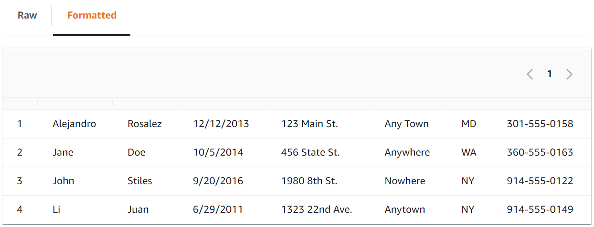

# Lab Introduction

This module presents an introduction to Amazon Simple Storage Service (Amazon S3). The course begins with Amazon S3 because it is an easy way to start working with the AWS Management Console. Also, because Amazon S3 is used throughout the course, you must know how to create Amazon S3 buckets and load data for subsequent labs.

At the end of this module, you will be able to:

- Describe the role of the Amazon S3 service in big data solutions.
- Explain how AWS Identity and Access Management (IAM) controls access to Amazon S3.
- Create an S3 bucket.
- Load data into an S3 bucket.
- Query resources in Amazon S3.

In this lab you will practice using the AWS management console to create an Amazon S3 bucket, create an IAM user with limited permissions to the Amazon S3 service, upload files to Amazon S3, and run simple queries on the data in Amazon S3.

# Create IAM user

In this task create an iam user named **djoe** with the required permissions. It is your job to know the required permissions for the user to do the job. Configure CLI access to the user.

# Task: Uploading sample data to an S3 bucket

In this task, you will upload a sample dataset to an S3 bucket. Name the bucket you will create **input-data**

Retrive below file in your laptop and unzip it. Make use of lab1.csv.

https://aws-tc-largeobjects.s3.us-west-2.amazonaws.com/CUR-TF-200-ACDSCI-1-DEV/lab-01-s3/code.zip

To view the contents the lab1.csv file, run the following command:

cat lab1.csv
The following are the contents of the file:

```sql
CustomerID,First Name,Last Name,Join Date,Street Address,City,State,Phone
1,Alejandro,Rosalez,12/12/2013,123 Main St.,Any Town,MD,301-555-0158
2,Jane,Doe,10/5/2014,456 State St.,Anywhere,WA,360-555-0163
3,John,Stiles,9/20/2016,1980 8th St.,Nowhere,NY,914-555-0122
4,Li,Juan,6/29/2011,1323 22nd Ave.,Anytown,NY,914-555-0149
```

Notice that the first row of the dataset contains column names.

Copy the data into the S3 bucket.

To retrieve the lab bucket name, run the following command:

`aws s3api list-buckets`

You should see the newly created bucket.

To copy the dataset file into the S3 bucket, run the following command. Replace <LAB-BUCKET-NAME> with the lab bucket name from the text file.

`aws s3 cp lab1.csv s3://<LAB-BUCKET-NAME>`

The output is similar to the following:

`upload: ./lab1.csv to s3://ade-s3lab-bucket-xxxxx/lab1.csv`

To confirm that the file was added to the bucket, run the following command. Replace <LAB-BUCKET-NAME> with the name of the bucket that you uploaded the file to:

`aws s3 ls s3://<LAB-BUCKET-NAME>`

The output is similar to the following:

`2022-02-23 20:04:06 337 lab1.csv`

Task summary
In this task, you downloaded and unzipped a sample dataset file. You examined the data and then used an AWS CLI command to copy the file to an S3 bucket.

Later in this course, you will learn about the advantages of storing datasets in Amazon S3 and how you can use the service as the foundation for a data lake. Therefore, it's important to understand how to use Amazon S3, including how to upload and retrieve your data.

# Task: Querying the data

In this task, you will use S3 Select to query the dataset.

- Use S3 Select to run a SQL query on the uploaded data.

  - Return to the tab that is open to the AWS Management Console.
  - In the search box next to Services, search for and choose S3.
  - In the Buckets list, choose the link for the bucket named **input-data**.

  - Choose the lab1.csv link.

  - Choose Object actions > Query with S3 Select.

  - In the Input settings section, configure the following:

    - Format: Keep CSV selected.
    - CSV delimiter: Keep Comma selected.
    - Select Exclude the first line of CSV data.
    - Compression: Keep None selected, because lab1.csv is not compressed.

  - In the Output settings section, keep the default values of CSV and Comma.

  - In the SQL query section, use the existing query, which is the following:

```sql
SELECT \* FROM s3object s LIMIT 5
```

This query will return the columns from the first five records of the dataset.

    - Choose Run SQL query.

The following results display in the Query results section, on the Raw tab.

```sql
1,Alejandro,Rosalez,12/12/2013,123 Main St.,Any Town,MD,301-555-0158
2,Jane,Doe,10/5/2014,456 State St.,Anywhere,WA,360-555-0163
3,John,Stiles,9/20/2016,1980 8th St.,Nowhere,NY,914-555-0122
4,Li,Juan,6/29/2011,1323 22nd Ave.,Anytown,NY,914-555-0149
```

This is the data that you uploaded but without the header row. By default, you see the results as raw data in CSV format.

    - To see the data in tabular format (rows and columns), choose the Formatted tab.

The following data displays in a tabular format.



- Now adjust the query to see only first names for the first three rows.

  - In the SQL query section, change the query text to the following:

```sql
SELECT "First Name" FROM s3object s LIMIT 3
```

Run the updated query.

**Note**: To successfully run this query, you must select Exclude the first line of CSV data in the Input settings section.

The following results display in the Query results section, on the Raw tab:

```
Alejandro
Jane
John
```

Now that you have completed these steps, you can share your findings with the team.

# Task summary

In this task, you used the S3 Select feature to query data. With this experience, you will be able to quickly discover and query data that is hosted in S3 buckets. This is one more tool that you can use for your analytics use cases.
