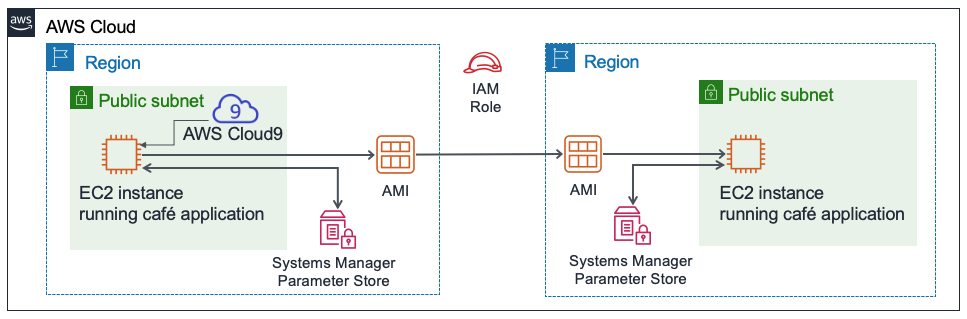

# Challenge Lab: Creating a Dynamic Website for the Café

## Scenario

After the café launched the first version of their website, customers told the café staff how nice the website looks. However, in addition to the praise, customers often asked whether they could place online orders.

**Sofía, Nikhil, Frank, and Martha** discussed the situation. They agreed that their business strategy and decisions should focus on delighting their customers and providing them with the best possible café experience.

## Lab overview and objectives

In this lab, you will deploy an application on an **Amazon Elastic Compute Cloud (Amazon EC2)** instance. The application enables the café to accept online orders. After testing that the application works as intended in the first AWS Region (the development environment), you will then create an Amazon Machine Image (AMI) from the EC2 instance. You will also deploy a second instance of the same application as the production environment in another AWS Region.

After completing this lab, you should be able to:

1. Create an EC2 instance, explore options, deploy a webserver (**httpd**) and confirm web server accessibility
2. Install a web application on an EC2 instance that also uses AWS Systems Manager Parameter Store
3. Test the web application
4. Create an AMI
5. Deploy a second copy of the web application to another AWS Region

At the end of this lab, your architecture should look like the following example:



# A business request for the café: Preparing an EC2 instance to host a website (Challenge #1)

The café wants to introduce online ordering for customers, and enable café staff to view submitted orders. Their current website architecture, where the website is hosted on **Amazon S3**, does not support the new business requirements.

In the first part of this lab, you will take on the role of **Sofía**. You will configure an Amazon EC2 instance so that it is ready to host a website for the café.

## Task: Create an EC2 instance for the website

- SSH to the instance by running below command:

`ssh -i <key-pair.pem> ec2-user@<public-ec2-ip>`

Rplace the <xxxx> with the appropriate values.
After that, run `sudo yum update -y`

- Observe the OS version by issuying below command:

  `cat /proc/version`

Notice how the output indicates it is an Amazon Linux instance, roughly analogous to Red Hat 7.

## Task: Install required packages

In order to accomplish the requirements, we need a web server, database, and PHP to be installed into the EC2 instance.

In the instance terminal, run these commands:

```shell
sudo yum install httpd -y
sudo systemctl start httpd
sudo systemctl enable httpd

sudo yum install -y mariadb-server
sudo systemctl start mariadb
sudo systemctl enable mariadb

sudo yum install php php-mysqlnd -y
sudo systemctl restart httpd
```

Now you will verify the installations

```shell
sudo httpd -v
sudo systemctl status httpd​
mysql --version
sudo systemctl status mariadb
​
php --version
```

The output should show the versions of the web server and the database, and also show that they are not currently running.

- Configure the EC2 instance so that you can use the AWS Cloud9 editor to edit web server files.

Notice that the AWS Cloud9 file browser currently does not display the Apache web server default web directory.

In the terminal, run these two commands:

```shell
ln -s /var/www/ /home/ec2-user/environment
sudo chown ec2-user:ec2-user /var/www/html
```

The first command you ran created a symlink from the default **AWS Cloud9** editor workspace to the **/var/www** directory that contains your web server files.

The second command changed ownership of the html subdirectory so that the **ec2-user** (which you are logged in as) can edit and create new files in it.

## Creating a simple test webpage

In the file browser, expand the **CafeWebServer > www** directory, and highlight the html directory.

**Choose File > New File**.

In the text editor tab, paste the following line:

```html
<html>
  Hello from the café web server!
</html>
```

Choose **File > Save**, and save the file in the html directory as index.html.
Save the file in the html directory as **index.html**.

Make the website accessible from the internet.

By using the public IP adress of the server, access the website.

## New business requirement: Installing a dynamic website application on the EC2 instance (Challenge #2)

In the previous challenge, you configured the EC2 instance. You have PHP, relational database and a running web server that can be accessed from the internet. You now have the basic setup for hosting a dynamic website for the café.

In the second part of this lab, you will take on the role of Sofía, and install the café application on the EC2 instance.

## Task: Installing the café application

- Download and extract the web server application files.

In the Bash terminal, run these commands:

```shell
wget https://aws-tc-largeobjects.s3-us-west-2.amazonaws.com/ILT-TF-200-ACACAD-20-EN/mod4-challenge/setup.tar.gz
tar -zxvf setup.tar.gz
wget https://aws-tc-largeobjects.s3-us-west-2.amazonaws.com/ILT-TF-200-ACACAD-20-EN/mod4-challenge/db.tar.gz
tar -zxvf db.tar.gz
wget https://aws-tc-largeobjects.s3-us-west-2.amazonaws.com/ILT-TF-200-ACACAD-20-EN/mod4-challenge/cafe.tar.gz
tar -zxvf cafe.tar.gz
```

Notice how the file browser now shows the three **.tar.gz** files that you downloaded.

You also extracted these archive files, which created the cafe, db, and setup directories in your work environment.

- Copy the café files over to the web server document root.

In the Bash terminal, run this command:

`mv cafe /var/www/html/`

- Observe how the application is designed to work.

  - Open the html/cafe/index.php source code in the editor.
  - Notice that this file has HTML code in it, but it also contains sections that are enclosed in elements. These elements make calls to other systems and resources.
  - For example, on line 18, you see that the PHP code references a file named `getAppParameters.php`.
  - Open the `getAppParameters.php` file in the code editor.
  - Notice on line `3` of this file that the `AWSSDK` is invoked.
  - Also, on lines `10–33`, the web application creates a client that connects to the ssm service, which is `AWS Systems Manager`. The application then retrieves seven parameters from Systems Manager. Those parameters have not been created in AWS Systems Manager yet, but you will do that next.

- In the **AWS Systems Manager Parameter Store**, configure the application parameters.

In the Bash terminal, run these commands:

```shell
cd setup
./set-app-parameters.sh
```

The shell script that you just ran issued AWS Command Line Interface (AWS CLI) commands. These commands added the parameters that the application will use to the **Parameter Store**.

- In the AWS Management Console, from the Services menu, choose **Systems Manager**.

- From the panel on the left, choose **Parameter Store**.

Notice how there are now seven parameters stored here.

The café application's PHP code references these values (for example, so that it can retrieve the connection information for the MySQL database).

Choose the **/cafe/dbPassword** parameter, and copy the Value to your clipboard. You will use this value in a moment.

- Configure the MySQL database to support the café application.

Back in the bash terminal, run the following commands:

```shell
cd ../db/
./set-root-password.sh
./create-db.sh
```

Observe the database tables that were created.

In the Bash terminal, run this command to connect the terminal-based MySQL client to the database:

`mysql -u root -p`
When you are prompted for the database password, paste the dbPassword parameter value that you copied.

You should now see a `mysql>` prompt, which indicates that you are now connected to the MySQL database that runs on this EC2 instance.


To observe the contents of the database (specifically, the tables that support the café web application), enter the following commands:

```sql
show databases;
use cafe_db;
show tables;
select \* from product;
exit;
```

Update the timezone configuration in PHP.

In the Bash terminal, run the following commands:

```shell
sudo sed -i "2i date.timezone = \"America/New_York\" " /etc/php.ini
sudo service httpd restart
```

The first command that you ran configured the time zone in the PHP software.

The second command that you ran restarted the web server so that the web server notices the configuration update.

Test whether the café website is working and can be accessed from the internet.

In a new browser tab, try to load the application at `http://<public-ip>/cafe` where `<public-ip>` is the IPv4 public IP address of the EC2 instance.

# If loaded, then congratulations!

# New business requirement: Creating development and production websites in different AWS Regions (Challenge #3)


Everyone at the café is impressed with the new dynamic website that Sofía created! Customers are delighted that they can now place online orders and schedule dessert items for pickup. Customer satisfaction has increased because of the reduced customer wait times.

However, another business requirement emerges, along with the praise. Martha and Frank would like to have two café websites:

One website that can be used as a development environment to mock up new features and web designs before they are released to customers
A separate website that will host the production environment that customers use
Sofía discussed the new requirement with Mateo when he came into the café one morning for his coffee. He suggested that, ideally, the two environments would exist in different AWS Regions. Such a design would have the added benefit of providing more robust disaster recovery (DR) in the unlikely scenario when an AWS Region becomes temporarily unavailable.

Sofía is now very busy! As she accomplishes more impressive work, her skills become more in-demand.

## Task 6: Creating an AMI and launching another EC2 instance

Because the café website already runs well on an existing EC2 instance, Sofía decides to duplicate it by creating an AMI from it. She will then launch a new instance from the new AMI.

You will continue to take on the role of Sofía for this task. Before you create an AMI out of this instance, you should create a new key pair, which might be important to have later in this lab.

Set a static internal hostname and create a new key pair on the EC2 instance.

In the bash terminal, run the following commands:

```shell
sudo hostname cafeserver
ssh-keygen -t rsa -f ~/.ssh/id_rsa
```

For the two times that you are prompted for a passphrase, press the ENTER key.

To make the new key available to the SSH utilities, in the Bash terminal, run the following command:

`cat ~/.ssh/id_rsa.pub >> ~/.ssh/authorized_keys`

In the AWS Management Console, browse to the EC2 service area and select the instance.

Choose Actions > Images and templates > Create Image.

Tip: Leave the Create Image dialog open in the browser tab while you answer some questions about AMIs.

Answering questions about AMIs

Return to the browser tab that has the questions for this lab. You accessed this tab earlier.

submit answers to the following questions:

1. Question: When you create an AMI from an instance, will the instance be rebooted?
2. Question: In what ways can you modify the root volume properties when you create an AMI from an instance?
3. Question: Can you add more volumes to an AMI that you create from an instance that only has one volume?

Back in the AWS Management Console, in the Create Image screen, create the new AMI:

**Image name:** CafeServer
Choose Create Image

From the navigation menu, choose AMIs and wait until the image status becomes Available. The process typically takes about 2 minutes. You may need to expand Images to find AMIs.

Create an AMI in another AWS Region

In this step, your objective is to create a new EC2 instance from the AMI that you just captured. However, you must create the new instance in the Oregon (us-west-2) AWS Region.

Create the new café instance from your AMI. The new instance that you create must match the following criteria.

**Region**: Oregon

**Instance Size**: t2.small

**Network**: Lab VPC Region 2, Public Subnet

**IAM Role**: CafeRole

**Tag:**

Key: Name
Value: ProdCafeServer
Security Group:

Create a new one named cafeSG, with TCP port 22 open to anywhere
Set TCP port 80 so that it's open to anywhere as well
Proceed without a key pair (the key pair that you created earlier in this lab should work to connect to it, if necessary)

Wait for the new instance to have a Public DNS value assigned to it, even if the status of the instance is still not Available.

Copy the Public DNS value. You will use it soon.

To create the needed AWS Systems Manager parameters in the new AWS Region, complete these steps.

Return to the N. Virginia (us-east-1) Region.

Open the CafeWebServer/setup/set-app-parameters.sh file in the text editor.

Edit line 12 of the file to match this setting:

```shell
region="us-west-2"
```

Edit line 18 to match this setting (where <public-dns-of-ProdCafeServer-instance> is the actual DNS of the ProdCafeServer instance):

```shell
publicDNS="<public-dns-of-ProdCafeServer-instance>"
```

Note: The line should still contain the quotation marks, but it should not contain the angle brackets (< >).

#### This example shows what line 12 should look like and how line 18 should be formatted. However, the value of your public DNS will be different.


File > Save the change.
To run this script, go to the top of the IDE and choose the Run button.
In the Bash terminal below the text editor, you should see output that's formatted in JavaScript Object Notation (JSON). This output indicates that the parameters script ran successfully.

If the script encountered an issue, click here to view troubleshooting tips.
Note: By changing the AWS Region details and running this script again, you created the same parameters that you created earlier in the us-east-1 Region of the AWS Systems Manager Parameter Store. However, this time, you created these parameters in the Oregon Region.

## Task: Verifying the new café instance

- Return to the EC2 Console in the Oregon Region, and verify that the new ProdCafeServer instance is running.

- Copy the IPv4 public IP address, and load it in a web browser.

The Hello from the cafe web server! message should display.

- Load the http://<public-ip>/cafe/ URL in a browser tab.

The entire café website should display.

- Load the Menu page.

The full Menu page should load, and the order-placing functionality should work.

- Place an order to verify that the website is working as intended.

Also, if you want to connect to the new EC2 instance in Oregon (us-west-2) to do some troubleshooting, run this command from the AWS Cloud9 IDE in us-east-1:

```shell
ssh -i ~/.ssh/id_rsa ec2-user@<public-ip-of-ProdCafeServer>
```

Note that <public-ip-of-ProdCafeServer> is the actual public IP address of the ProdCafeServer instance.

# Update from the café


Sofía is now a hero at the cafe! She created a dynamic website, and she also created a duplicate version of the same website that runs in a second AWS Region.

Sofía decided to designate the first EC2 instance that she created—the one in the us-east-1 Region—as the development instance. The second instance she created—the one in Oregon (the us-west-2 Region)—will be the production instance.

This way, Sofía and any other application developers can test application enhancements on the development site without affecting the production site. Then, when the developers decide that the enhancements look good and they have fully tested them, they can migrate the code to the production site.

Sofía explained to her parents, Frank and Martha, what she had done. Though they didn't fully understand all the technical terms that Sofía used, they were pleased to know that the website can now take online orders. They were also glad to hear that they can now test new enhancements to the website without immediately exposing those changes to customers.

Submitting your work

Lab complete
Congratulations! You have completed the lab.
