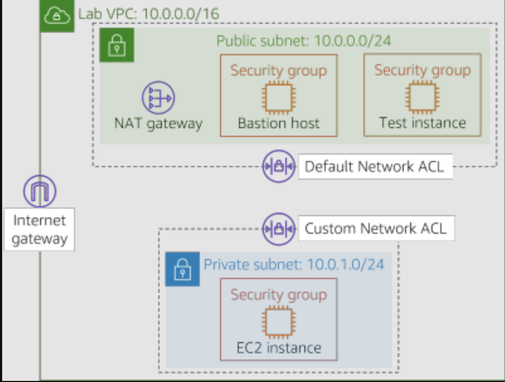
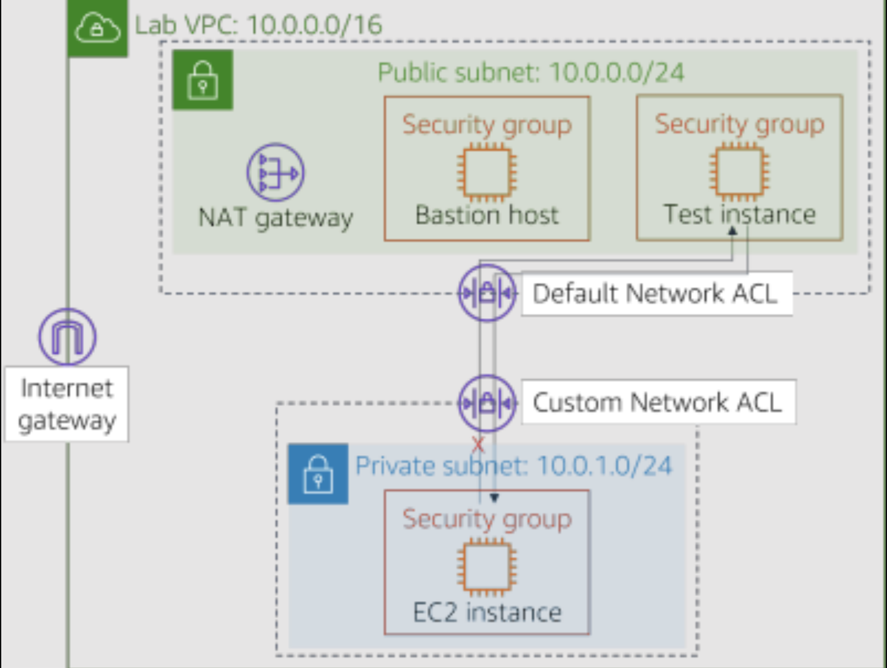

# Challenge Lab: Creating a VPC Networking Environment for the Café

## Scenario

Sofía and Nikhil are now confident in their ability to create a two-tier architecture because of their experience migrating the café's data. They successfully moved from a MariaDB database on an Amazon Elastic Compute Cloud (Amazon EC2) instance to an Amazon Relational Database Service (Amazon RDS) database instance. In addition, they also moved their database resources from a public subnet to a private subnet.

When Mateo—a café regular and an AWS systems administrator and engineer—visits the café, Sofía and Nikhil tell him about the database migration. Mateo tells them that they can enhance security by running the café's application server in another private subnet that's separate from the database instance. They could then go through a bastion host (or jump box) to gain administrative access to the application server. The application server must also be able to download needed patches.

Knowing that <a href="https://aws.amazon.com/fr/blogs/enterprise-strategy/create-a-culture-of-experimentation-enabled-by-the-cloud/" target="_blank">the cloud makes experimentation easier</a> , Sofía and Nikhil are eager to set up a non-production VPC environment. They can use it implement the new architecture and test different security layers, without accidentally disrupting the café's production environment.

## Lab overview and objectives

In this lab, you use Amazon Virtual Private Cloud (Amazon VPC) to create a networking environment on AWS and implement security layers to protect your resources.

After completing this lab, you should be able to:

- Create a virtual private cloud (VPC) environment that enables you to securely connect to private resources
- Enable your private resources to connect to the internet
- Create an additional layer of security in your VPC to control traffic to and from private resources
  When you start the lab, you will only have a VPC created for you in the AWS account.

At the end of this lab, your architecture should look like the following example:

(In the diagram, the communication arrows were omitted for simplicity.)

**Note:** in this challenge lab, step-by-step instructions are not provided for most of the tasks. You must figure out how to complete the tasks on your own.

# A business request for the café: Creating a VPC network that allows café staff to remotely and securely administer the web application server (Challenge #1)

In this challenge, you will take on the role of one of the café's system administrators. You will create and configure a VPC network so that you can securely connect from a bastion host in a public subnet to an EC2 instance in a private subnet. You will also create a NAT gateway to enable the EC2 instance in your private subnet to access the internet.

## Task 1: Creating a public subnet

Your first task in this lab is to create a public subnet in the Lab VPC. After you create a public subnet, you will create an internet gateway to allow communication from the subnet to the internet. You will update the routing table that's attached to the subnet to route internet-bound network traffic through the internet gateway.

- Open the Amazon VPC console.

- Note that a VPC called Lab VPC was created for you.

- Create a public subnet that meets the following criteria:

  - Name tag: Public Subnet
  - VPC: Lab VPC
  - Availability Zone: Choose Availability Zone a of your Region (for example, if your Region is us-east-1, then select us-east-1a)
  - IPv4 CIDR block: 10.0.0.0/24

- Create a new internet gateway and attach it to the Lab VPC.

- Edit the route table that was created in your VPC. Add the route 0.0.0.0/0. For the target, select the internet gateway that you created in the previous step

**Hint:** To successfully complete this task, you must create a few resources. If you get stuck, refer to the AWS <a href="https://docs.aws.amazon.com/vpc/latest/userguide/VPC_Internet_Gateway.html">Documentation</a>.

## Task 2: Creating a bastion host

In this task, you will create a bastion host in the Public Subnet. In later tasks, you will create an EC2 instance in a private subnet and connect to it from this bastion host.

- From the Amazon EC2 console, create an EC2 instance in the Public Subnet of the Lab VPC that meets the following criteria:

  - Amazon Machine Image (AMI): Amazon Linux 2023 AMI (HVM)

  - Instance type: t2.micro

  - Auto-assign Public IP: This setting should be disabled

  - Name: Bastion Host

  - Security group called Bastion Host SG that only allows the following traffic:

    - Type: SSH
    - Port: 22
    - Source: Your IP address
    - Uses or create a key pair

**Note:** In practice, hardening a bastion host involves more work than only restricting Secure Shell (SSH) traffic from your IP address. A bastion host is typically placed in a network that's closed off from other networks. It's often protected with multi-factor authentication (MFA) and monitored with auditing tools. Most enterprises require an auditable access trail to the bastion host.

## Task 3: Allocating an Elastic IP address for the bastion host

In this task, you will assign an Elastic IP address to the bastion host.

The bastion host that you just created can't be reached from the internet. It doesn't have a public IPv4 address or an Elastic IP address that's associated with its private IPv4 address. Elastic IP addresses are associated with bastion instances and are allowed from on-premises firewalls. If an instance is terminated and a new instance is launched in its place, the existing Elastic IP address is re-associated with the new instance. With this behavior, the same trusted Elastic IP address is used at all times.

Allocate an Elastic IP address, and make it reachable from the internet over IPv4 by associating it with your bastion host.

## Task 4: Testing the connection to the bastion host

In this task, you will use the SSH key (.pem file or .ppk file) to test the SSH connection to your bastion host.

Microsoft Windows PuTTY users: Download PPK
macOS or Linux users: Download PEM
To close the window, choose X.

Connect to your bastion host by using SSH.

After you have tested your connection to the bastion host, you can close the terminal or PuTTY.

**Hint:** If you get stuck, refer to the AWS Documentation. This page provides detailed instructions about how to use SSH to connect to an EC2 instance.

Note for Microsoft Windows users: If you don't have PuTTY installed, you must download and install PuTTY. We recommend that you configure PuTTY so that your connection doesn't expire. To keep the PuTTY session open longer, set Seconds between keepalives to 30.

## Task 5: Creating a private subnet

In this task, you will create a private subnet in the Lab VPC.

- In the console, create a private subnet that meets the following criteria:

  - Name tag: Private Subnet
  - Availability Zone: Same as Public Subnet
  - IPv4 CIDR block: 10.0.1.0/24

## Task 6: Creating a NAT gateway

In this task, you will create a NAT gateway, which enables resources in the Private Subnet to connect to the internet.

- Create a NAT gateway that meets the following criteria:

  - Name: Lab NAT Gateway
  - Subnet: Public Subnet
  - Tip: Your NAT gateway needs an Elastic IP address.

- Create a new route table that meets the following criteria:

  - Name tag: Private Route Table
  - Destination: 0.0.0.0/0
  - Target: NAT Gateway
  - Attach this route table to the Private Subnet, which you created earlier.

**Hint:** If you get stuck, refer to the AWS Documentation.

## Task 7: Creating an EC2 instance in the private subnet

In this task, you will create an EC2 instance in the Private Subnet, and you will configure it to allow SSH traffic from the bastion host. You will also create a new key pair to access this instance.

- Create a new key pair named vockey2, and download the appropriate .ppk (Microsoft Windows) or .pem (macOS or Linux).

- Create an EC2 instance in the Private Subnet of the Lab VPC that meets the following criteria.

        - AMI: Amazon Linux 2023 AMI (HVM)

        - Instance type: t2.micro

        - Name: Private Instance

        - Only allows the following traffic:

            - Type: SSH
            - Port: 22
            - Source: Bastion host security group

  **Hint:** Refer to the <a href="https://docs.aws.amazon.com/AWSEC2/latest/UserGuide/ec2-security-groups.html" target="_blank">AWS Documentation</a>

  Uses the your key pair that you created earlier

## Task 8: Configuring your SSH client for SSH passthrough

Because the private instance you just created uses a different key pair than the bastion host, you must configure your SSH client to use SSH passthrough. This action allows you to use a key pair that's stored on your computer to access the private instance without uploading the key pair to the bastion host. This is a good security practice.

To set up your client, follow either the Microsoft Windows, or the macOS or Linux steps.

Microsoft Windows users only
Windows users should complete the following steps.

Download and install Pageant, which is available from the PuTTY download page.

After you install Pageant, open it. Pageant runs as a Windows service.

To import the PuTTY-formatted key into Pageant, follow these steps.

In the Windows system tray, double-click the Pageant icon. Pagent Icon
Choose Add Key.
Select the .ppk file that you downloaded when you created the vockey2 key pair.  
Your screen should look similar to the following example.

- Add the first vockey that you downloaded earlier. The filename was labuser.\*.

- You should now have two keys listed. You can close the Pageant window.

- In PuTTY, under Connection > SSH > Auth, select Allow agent forwarding. Expand Auth and choose Credentials. Under Private key file for authentication choose Browse. Browse to the labsuser.ppk file that you downloaded, select it, and choose Open. Choose Accept. After you have completed this step, continue on to Task 9, step 32. Proceed to connect to the bastion host using PuTTY as you normally would, but don't open a .ppk file.

**macOS or Linux users only**

For macOS users, ssh-agent is already installed as part of the OS. To add your keys, complete the following steps.

Add your private keys to the keychain application by using the ssh-add command, with the -K option and the .pem file for the key. The command should look like the following example.

`ssh-add -K <your-key-pair.pem>`

Make sure that you add both the vockey.pem and vockey2.pem keys that you downloaded.

By adding the key to the agent, you can use SSH to connect to an instance without using the –i option when you connect.

To verify that the keys are available to ssh-agent, use the ssh-add command with the -L option, like the following example.

`ssh-add –L`

The agent should display the keys that it's stored.

After the key is added to your keychain, you can connect to the bastion host instance with SSH by using the –A option. This option enables SSH agent forwarding. It also allows the local SSH agent to respond to a public key challenge when you use SSH to connect from the bastion host to a target instance in your VPC.

For example, to connect to an instance in a private subnet, you would enter the following command (this command enables SSH agent forwarding by using the bastion host instance):

`ssh –A ec2-user@<bastion-IP-address-or-DNS-entry>`

After you’re connected to the bastion host instance, you can use SSH to connect to a specific instance by entering a command like this example.

`ssh user@<instance-IP-address-or-DNS-entry>`

**Note:** The ssh-agent doesn't know which key it should use for a given SSH connection. Therefore, ssh-agent will sequentially try all the keys that are loaded in the agent. Because instances terminate the connection after five failed connection attempts, make sure that the agent has five or fewer keys. Because each administrator should have only a single key, this is usually not a problem for most deployments. For details about how to manage the keys in ssh-agent, use the man ssh-agent command.

## Task 9: Testing the SSH connection from the bastion host

In this task, you will test the SSH connection from your bastion host to the EC2 instance that is running in the Private Subnet.

Connect to the bastion host instance by using SSH.

Tip: Use the connection method that was described in the SSH passthrough section.

Connect to the private instance by using SSH and the IP address for the private instance.

ssh ec2-user@<private-ip-address-of-instance-in-private-subnet>
Now that you are connected to the EC2 instance in the Private Subnet, test its connection to the internet.

`ping 8.8.8.8`
**Tip:** Press `CTRL+C` to exit the command

You have now established communication between the Bastion Host in the Public Subnet and the EC2 instance in the Private Subnet, like in the following diagram:

Architecture best practice

In this first challenge, you implemented the architectural best practice of enable people to perform actions at a distance.

**Architecture best practice**

In this second challenge, you protected your network resources by implementing the architectural best practice of controlling traffic at all layers.

- In this page, please answer the following questions:

  - **Question 1:** What is the purpose of the internet gateway in the public subnet?
  - **Question 2:** What allows the instance in the private subnet to connect to the internet so that it can download updates?
  - **Question 3:** Can the instance in the private subnet be accessed directly from the internet?
  - **Question 4:** Why do you use two different key pairs to access the private instance and the bastion host?
  - **Question 5:** Can the bastion host use ping and get a reply from the instance in the private subnet?
  - **Question 6:** Which security group rules allow the private EC2 instance to receive the return traffic when it pings the test instance?
