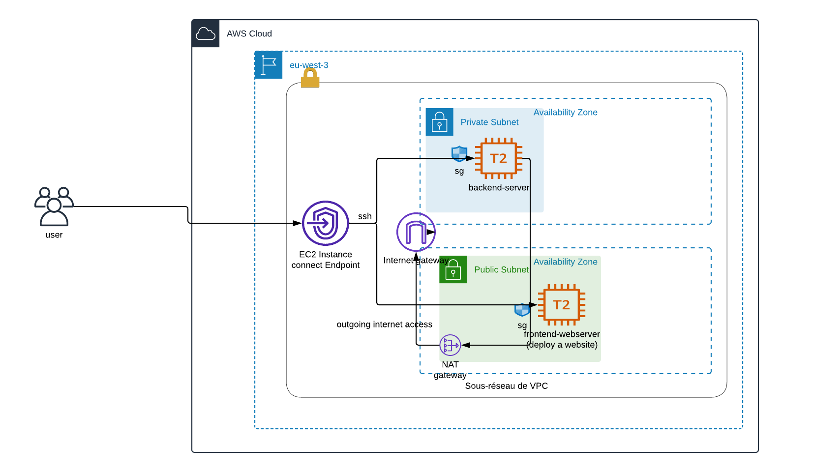

# Challenge Lab: Creating a VPC Networking Environment for the Café

## Lab overview and objectives

In this lab, you will use Amazon Virtual Private Cloud (Amazon VPC) to create a networking environment on AWS and implement security layers to protect your resources.

After completing this lab, you should be able to:

- Create a virtual private cloud (VPC) environment that enables you to securely connect to private resources
- Enable your private resources to connect to the internet
- SSH to the instances using SSH EC2 Instance Connect

At the end of this lab, your architecture should look like the following example:

(In the diagram, the communication arrows were omitted for simplicity.)

**Note:** in this challenge lab, step-by-step instructions are not provided for most of the tasks. You must figure out how to complete the tasks on your own.

# Creating a VPC network infrastructure and host a website (Challenge #1)

In this challenge, you will take on the role of one of the café's system administrators. You will create and configure a VPC network so that you can securely connect using EC2 Instance Connect Endpoint. You will also create a NAT gateway to enable the EC2 instance in your private subnet to access the internet.

## Task 1: Creating a public subnet

Your first task in this lab is to create a public subnet in the Lab VPC. After you create a public subnet, you will create an internet gateway to allow communication from the subnet to the internet. You will update the routing table that's attached to the subnet to route internet-bound network traffic through the internet gateway.

- Open the Amazon VPC console.

- Create a new vpc called cafe-network.

- Create a public subnet that meets the following criteria:

  - **Name tag**: Public Subnet
  - **VPC**: Lab VPC
  - **Availability Zone**: Choose Availability Zone a of your Region
  - IPv4 CIDR block: 10.0.0.0/24

- Create a new internet gateway (**cafe-router**) and attach it to the newly created VPC.

- Edit the route table that was created in your VPC. Add the route **0.0.0.0/0**. For the target, select the **internet gateway** that you created in the previous step

**Hint:** To successfully complete this task, you must create a few resources. If you get stuck, refer to the AWS <a href="https://docs.aws.amazon.com/vpc/latest/userguide/VPC_Internet_Gateway.html">Documentation</a>.

## Task 2: Creating a publicly accessible server

In this task, you will create a publicly accessible server in the Public Subnet. In later tasks, you will create an EC2 instance in a private subnet and connect to it using EC2 Instance Connect.

- From the Amazon EC2 console, create an EC2 instance in the Public Subnet of the Lab VPC that meets the following criteria:

  - **Amazon Machine Image (AMI)**: Amazon Linux 2023 AMI (HVM)

  - **Instance type**: t2.micro

  - **Auto-assign Public IP**: This setting should be disabled

  - **Name**: Bastion Host

  - Security group called Cafe SG that only allows the following traffic:

    - **Type**: SSH
    - **Port**: 22
    - **Source**: Anywhere
    - Key pair is optional as you will use EC2 Instance Connect Endpoint

## Task 3: Testing the connection to the public server

- Make sure to install aws cli latest version

Follow <a href="https://docs.aws.amazon.com/AWSEC2/latest/UserGuide//ec2-instance-connect-methods.html" target="_blank"> these instructions</a> to use EC2 Instance Connect to ssh into the instance

## Task 5: Creating a private subnet

In this task, you will create a private subnet in the Lab VPC.

- In the console, create a private subnet that meets the following criteria:

  - **Name tag**: Private Subnet
  - **Availability Zone**: Same as Public Subnet
  - **IPv4 CIDR block**: 10.0.1.0/24

## Task 6: Creating a NAT gateway

In this task, you will create a NAT gateway, which enables resources in the Private Subnet to connect to the internet.

- Create a NAT gateway that meets the following criteria:

  - **Name**: Lab NAT Gateway
  - **Subnet**: Public Subnet
  - **Tip**: Your NAT gateway needs an Elastic IP address.

- Create a new route table that meets the following criteria:

  - **Name tag**: Private Route Table
  - **Destination**: 0.0.0.0/0
  - **Target**: NAT Gateway
  - Attach this route table to the Private Subnet, which you created earlier.

**Hint:** If you get stuck, refer to the AWS Documentation.

## Task 7: Creating an EC2 instance in the private subnet

In this task, you will create an EC2 instance in the Private Subnet, and you will configure it to allow SSH traffic from the bastion host. You will also create a new key pair to access this instance.

- Create a new key pair named vockey2, and download the appropriate .ppk (Microsoft Windows) or .pem (macOS or Linux).

- Create an EC2 instance in the Private Subnet of the Lab VPC that meets the following criteria.

        - AMI: Amazon Linux 2023 AMI (HVM)

        - Instance type: t2.micro

        - Name: Private Instance

        - Only allows the following traffic:

            - Type: SSH
            - Port: 22
            - Source: Bastion host security group

  **Hint:** Refer to the <a href="https://docs.aws.amazon.com/AWSEC2/latest/UserGuide/ec2-security-groups.html" target="_blank">AWS Documentation</a>

  Uses the your key pair that you created earlier

## Task 8: Configuring your EC2 Instance Connect Endpoint and Connect to private instance

- Follow <a href="https://docs.aws.amazon.com/AWSEC2/latest/UserGuide/create-ec2-instance-connect-endpoints.html" target="_blank"> these instructions</a> to create an EC2 Instance Connect Endpoint that can allow to ssh into the private instance.

- In order to connect to the instance, please follow <a href="https://docs.aws.amazon.com/AWSEC2/latest/UserGuide/connect-using-eice.html" target="_blank"> these instructions</a>

For example, to connect to an instance in a private subnet, you would enter the following command (this command enables SSH agent forwarding by using the bastion host instance):

**Note:** By using EC2 Instance connect endpoint, you don't need a key pair..

Now that you are connected to the EC2 instance in the Private Subnet, test its connection to the internet.

`ping 8.8.8.8`
**Tip:** Press `CTRL+C` to exit the command

Architecture best practice

In this first challenge, you implemented the architectural best practice of enable people to perform actions at a distance.

**Architecture best practice**

In this second challenge, you protected your network resources by implementing the architectural best practice of controlling traffic at all layers.

- In this page, please answer the following questions:

  - **Question 1:** What is the purpose of the internet gateway in the public subnet?
  - **Question 2:** What allows the instance in the private subnet to connect to the internet so that it can download updates?
  - **Question 3:** Can the instance in the private subnet be accessed directly from the internet?
  - **Question 4:** Why do you use two EC2 instance connect endpoint and what are the benefits ?
