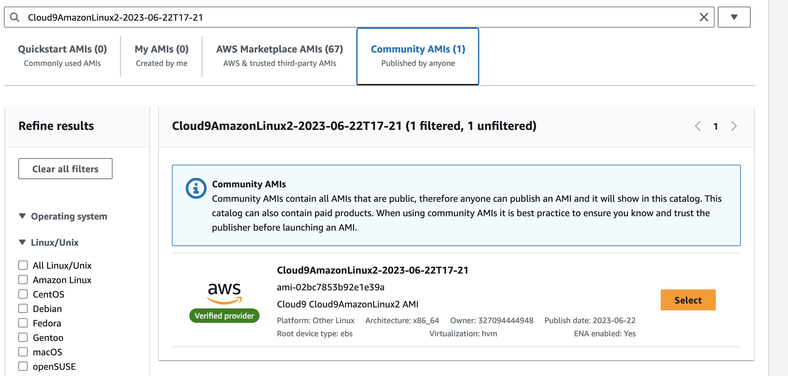
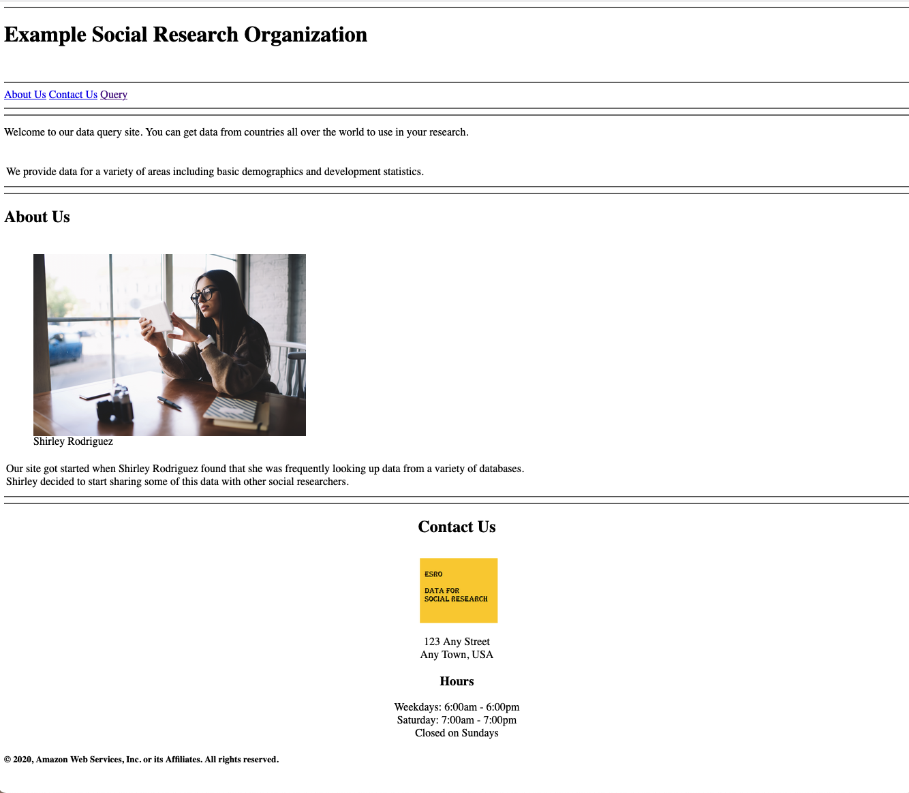
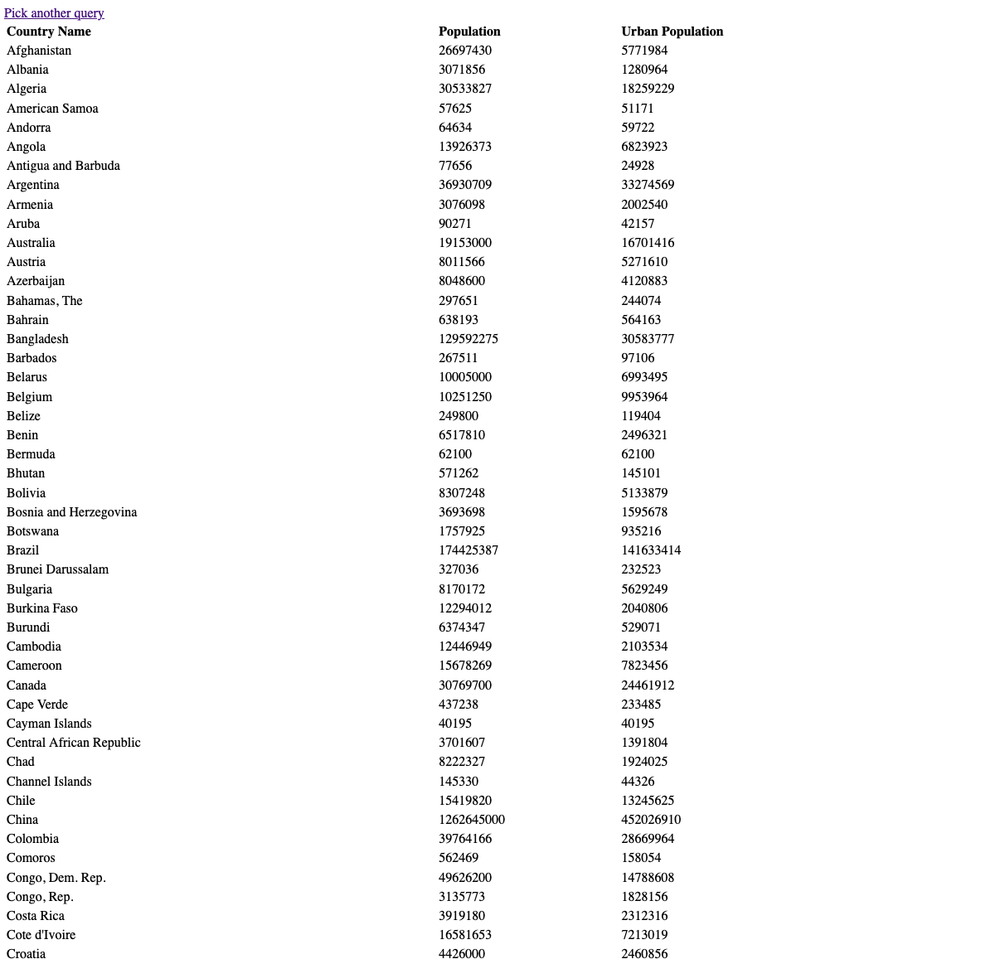
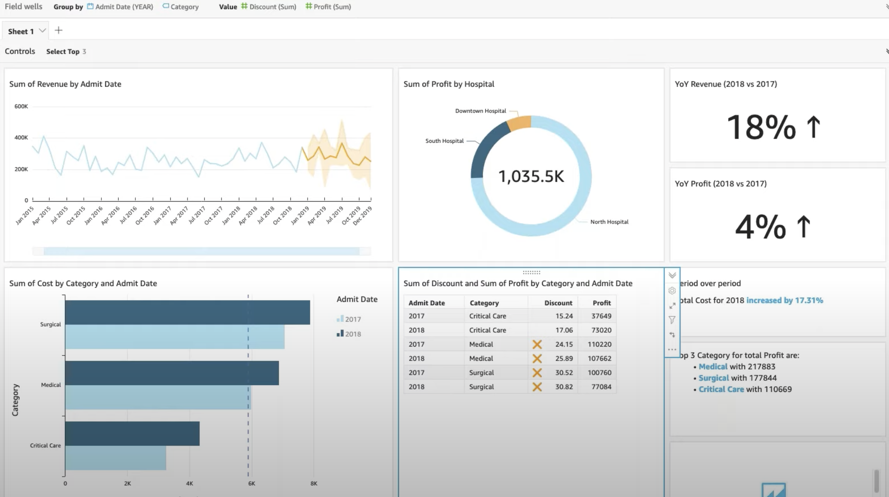

# AWS Cloud & Big Data Architectures - Project

---

Table of Contents

1.  [Environment Overview](#overview)
2.  [Project Overview](#project)
3.  [Introducing the Example Social Research Organization](#intro)
4.  [Solution requirements](#requirements)
5.  [Project deliverables](#deliverables)
6.  [Assets for completing the project](#assets)

---

<div id='overview'/>

## Environment Cost

Make sure your delete all resources after completing.

**_Suggestions to avoid overspending:_**

- Launch only the number of EC2 instances you need, sized to your requirements.

- Delete no longer needed resources and data.
- If you choose Cloud9, delete the Cloud9 environment when you complete the project (This will automatically delete the created EC2 instance)

- Typically, it is compute-type resources, such as EC2, RDS, Cloud9, NAT Gateway instances, that you leave running that most quickly use up your budget. Turn these off when no longer needed, or better yet, delete them.

- Stop any NAT gateways, EC2 instances, and RDS instances when not in use. If you will be building this solution over the course of a few weeks or months, consider deleting these resources entirely to save budget. You can always recreate them again later.

  - Be aware that if you do stop an RDS instance or cluster and leave it stopped for seven days, AWS may start it again automatically, which will increase the cost impact.
  - NAT Gateway resources if left in your account, will also use up your bill.

- Use the <a href="https://calculator.s3.amazonaws.com/index.html">AWS Simple Monthly Calculator</a> or AWS <a href="https://calculator.aws/">Pricing Calculator</a> to estimate cost. Example: the estimate shown in the screenshot below calculated the cost of running the following resources for a month:

  - One t3.medium size Linux EC2 instance running 6 hours per day for a month in the us-east-1 Region.

  - One db.t2.small size MySQL RDS database with 20GB of storage, left running for a month in the us-east-1 Region.
  - One NAT Gateway left running, processing 1GB per month in the us-east-1 Region

Pricing is subject to change. The calculation above is just an example from a point in time.

<div id='project'/>

# Project overview

This project provides you with an opportunity to demonstrate the solution design skills that you develop throughout this course. Your assignment is to design and deploy a solution for the following case.

By the end of this project, you should be able to apply the architectural design principles that you learned in this course to:

- Deploy a PHP application that runs on an Amazon Elastic Compute Cloud (Amazon EC2) instance.
  - **Note:** If you choose not to use Cloud9 service, Please make use of the AMI **Cloud9AmazonLinux2-2023-06-22T17-21** when launching your own EC2 instance.
    
- Create a Mariadb database from a structured query language (SQL) dump file using Amazon <a href="https://aws.amazon.com/fr/rds/">Relational Database Service (RDS)</a>. Make sure to use <a href="https://aws.amazon.com/fr/rds/pricing/">Free Tier</a> options only. This is the database the PHP application can query.
- Update application parameters in an AWS Systems Manager Parameter Store

<div id='intro'/>

# Introducing the Example Social Research Organization

Example Social Research Organization is a (fictitious) nonprofit organization that provides a website for social science researchers to obtain global development statistics. For example, visitors to the site can look up various data, such as the life expectancy for any country in the world over the past 10 years.

Shirley Rodriguez, a researcher at the organization, developed the website. She thought it would be valuable to share the data that she had gathered with other researchers. Shirley stores the data in a MySQL database, and the data is available through a PHP website that she built. She initially published the site through a commercial hosting company that provides limited support for technical issues and security.

Over the past year, Shirley’s website has grown in popularity. As a result of increased traffic, she started receiving complaints that the site is not as responsive as it used to be. She also experienced an attempted ransomware security breach. The security breach was unsuccessful, but her supervisor, Mateo Jackson, suggested that Shirley investigate new ways to host the website.

Shirley heard about Amazon Web Services (AWS), and initially moved her website and database to an EC2 instance that runs in a public subnet. She also runs an instance of MySQL on the same EC2 instance.

Shirley approached your team to make sure that her current design follows best practices. She wants to make sure that she has a robust and secure website. One of your colleagues started the process of migrating the site to a more secure implementation, but they were reassigned to another project. Your tasks are to complete the implementation, make sure that the website is secure, and confirm that the website returns data from the query page.

<div id='requirements'/>

## Solution requirements

- Design an Architecture diagram for your Infrastructure solution. Feel free to use Microsoft Office or <a href="https://www.lucidchart.com/">LucidChart</a> or <a href="https://app.diagrams.net">DrawIO</a>

- Provide secure hosting of the MySQL database. Make use of RDS service. The database need be private only (Not public access)

- Make use of EC2 Instance Connect to connect to the database from your local machine

- Provide anonymous access to web users

- Run the website on a t2.micro EC2 instance, and provide Secure Shell (SSH) access to administrators by using EC2 Instance Connect (No Key Pair is needed from AWS side).

- Make sure you adopt the least privilege for IAM permissions needed.

- Store database connection information in the AWS Systems Manager Parameter Store

- The entiere deployment need to be inside your own custom network stack. The RDS need to be inside the private subnet and the EC2 inside the public one. Please make sure only the EC2 instance can access the database by making use of security group inbound rules.
- Make use of Cloud9 service to avoid some issues
- The lab need to be done in your own defined network infrastructure. Your work will not be considered if you use the default VPC.

The following parameters are used by the PHP application to connect to the database:

- /example/endpoint
- /example/username
- /example/password
- /example/database

**These parameter values are case sensitive.**

<div id='deliverables'/>

## Project deliverables

To complete this assignment, you must:

- Deploy a PHP application that meets the system requirements outlined above
  Submit a diagram that illustrates your solution

- Submit a written summary of the design decisions that you made to achieve the result. Feel free to choose any format your want.
- Make sure to put all the necessary screenshots that demonstrate your work at every step.

<div id='assets'/>

## Assets for completing the project

You can use the following assets for this project:

- <a href="https://efrei-capstone.s3.amazonaws.com/Countrydatadump.sql">A SQL dump file that contains sample data</a>
- <a href="https://efrei-capstone.s3.amazonaws.com/Example.zip">A .zip file that contains the PHP and image files for the Example Social Research Organization website</a>

  **Note:** If you use Cloud9, make sure you are able to execute below shell script inside the created EC2 directly from Cloud9 interface. If you are using your own created EC2, make sure to install the appropriate packages.

```shell
#!/bin/bash -ex
yum -y update
amazon-linux-extras install -y lamp-mariadb10.2-php7.2 php7.2
yum install -y httpd mariadb-server
chkconfig httpd on
service httpd start
cd /home/ec2-user
wget https://aws-tc-largeobjects.s3.us-west-2.amazonaws.com/CUR-TF-200-ACACAD-2/21-course-project/s3/Countrydatadump.sql
chown ec2-user:ec2-user Countrydatadump.sql
cd /var/www/html
wget https://aws-tc-largeobjects.s3.us-west-2.amazonaws.com/CUR-TF-200-ACACAD-2/21-course-project/s3/Example.zip
unzip Example.zip -d /var/www/html/
chown -R ec2-user:ec2-user /var/www/html
```

Note: if the wget command does not works, feel free to download the assets from below links:

- https://efrei-capstone.s3.amazonaws.com/Countrydatadump.sql
- https://efrei-capstone.s3.amazonaws.com/Example.zip

# The Website

## Home Page



## Search Result



# QUIZ

There are some images inside **iam quizz** and **network quizz** folder. Your job is to answer the questions by specifying correct answers.
For example if the first option is the correct answer, say **Option 1**

# IAM

This part is to make sure you are able to evaluate and apply some policy constraintes.

## Policies evaluation

Please evaluate below IAM policies

```json
{
  "Version": "2012-10-17",
  "Statement": [
    {
      "Sid": "AllowEC2AndS3",
      "Effect": "Allow",
      "Action": [
        "ec2:RunInstances",
        "ec2:TerminateInstances",
        "s3:GetObject",
        "s3:PutObject"
      ],
      "Resource": [
        "arn:aws:ec2:us-east-1:123456789012:instance/*",
        "arn:aws:s3:::example-bucket/*"
      ]
    }
  ]
}
```

### Question: What actions are allowed for EC2 instances and S3 objects based on this policy? What specific resources are included?

```json
{
  "Version": "2012-10-17",
  "Statement": [
    {
      "Sid": "AllowVPCAccess",
      "Effect": "Allow",
      "Action": [
        "ec2:DescribeVpcs",
        "ec2:DescribeSubnets",
        "ec2:DescribeSecurityGroups"
      ],
      "Resource": "*",
      "Condition": {
        "StringEquals": {
          "aws:RequestedRegion": "us-west-2"
        }
      }
    }
  ]
}
```

### Question: Under what condition does this policy allow access to VPC-related information? Which AWS region is specified?

```json
{
  "Version": "2012-10-17",
  "Statement": [
    {
      "Sid": "AllowS3ReadWrite",
      "Effect": "Allow",
      "Action": ["s3:GetObject", "s3:PutObject", "s3:ListBucket"],
      "Resource": [
        "arn:aws:s3:::example-bucket",
        "arn:aws:s3:::example-bucket/*"
      ],
      "Condition": {
        "StringLike": {
          "s3:prefix": ["documents/*", "images/*"]
        }
      }
    }
  ]
}
```

### Question: What actions are allowed on the "example-bucket" and its objects based on this policy? What specific prefixes are specified in the condition?

```json
{
  "Version": "2012-10-17",
  "Statement": [
    {
      "Sid": "AllowIAMUserCreation",
      "Effect": "Allow",
      "Action": "iam:CreateUser",
      "Resource": "arn:aws:iam::123456789012:user/${aws:username}"
    },
    {
      "Sid": "AllowIAMUserDeletion",
      "Effect": "Allow",
      "Action": "iam:DeleteUser",
      "Resource": "arn:aws:iam::123456789012:user/${aws:username}"
    }
  ]
}
```

### Question: What actions are allowed for IAM users based on this policy? How are the resource ARNs constructed?

```json
{
  "Version": "2012-10-17",
  "Statement": {
    "Effect": "Allow",
    "Action": ["iam:Get*", "iam:List*"],
    "Resource": "*"
  }
}
```

### Questions:

- Which AWS service does this policy grant you access to?
- Does it allow you to create an IAM user, group, policy, or role?
- Go to https://docs.aws.amazon.com/IAM/latest/UserGuide/ and in the left navigation expand Reference > Policy Reference > Actions, Resources, and Condition Keys. Choose Identity And Access Management. Scroll to the Actions Defined by Identity And Access Management list.Name at least three specific actions that the **iam:Get\*** action allows.

```json
{
  "Version": "2012-10-17",
  "Statement": [
    {
      "Condition": {
        "StringEquals": {
          "ec2:InstanceType": ["t2.micro", "t2.small"]
        }
      },
      "Resource": "arn:aws:ec2:*:*:instance/*",
      "Action": ["ec2:RunInstances", "ec2:StartInstances"],
      "Effect": "Deny"
    }
  ]
}
```

### Questions:

- What actions does the policy allow?
- Say that the policy included an additional statement object, like this **example:**

```json
{
  "Effect": "Allow",
  "Action": "ec2:*"
}
```

- How would the policy restrict the access granted to you by this additional statement?
- If the policy included both the statement on the left and the statement in question 2, could you terminate an m3.xlarge instance that existed in the account?

# Big Data - Data Visualization With AWS QuickSight

A sample dataset download from <a href="https://www.kaggle.com/">kaggle</a> is available <a href="https://efrei-capstone.s3.amazonaws.com/Patient-Info.csv">here</a>. Please make use of this dataset to create some interesting dashboard.
As minimum requirement, your dashboard should be similar to below but feel free to extend it.


Note: The final result does not matter. What matter is to showcase every actions you took in order to achieve it. So please make sure you take screenshot at each step of your work that demonstrate your work.

# Notations:

**Task 1 (App deployment)**: 10
**QUIZZ**: 3
**IAM**: 2
**AWS Quicksight**: 5
